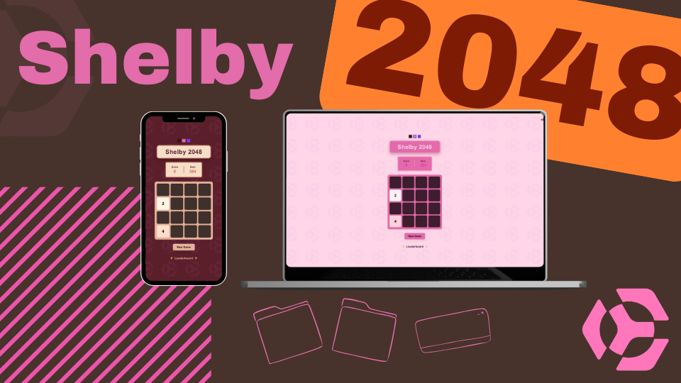

# Shelby 2048 — Decentralized Leaderboard Experiment

<p align="center">
  
</p>

🎮 **Live Demo**  
https://shelby-2048.vercel.app

---

## About

Shelby 2048 is a simple browser-based 2048 game built to experiment with **Shelby's decentralized data layer**.

The goal of this project is to explore how Shelby can be used as a **backend storage layer for global game leaderboards**.

Instead of relying on a traditional centralized database, leaderboard entries are intended to be stored and retrieved from **Shelby's distributed storage network**, allowing anyone to read leaderboard data globally.

This project is part experiment, part prototype, exploring how decentralized storage can power real-time web applications.

---

## Features

- Classic **2048 gameplay**
- Global leaderboard
- Responsive UI (desktop & mobile)
- Score submission system
- Experimenting with **Shelby-powered storage**

---

## Shelby Integration

This project is currently experimenting with **Shelby as a decentralized storage backend** for leaderboard data.

## Fair Play & Anti-Spam

To prevent leaderboard abuse, the system will introduce submission limits for both human players and AI agents.

Planned safeguards include:

- Score submission rate limits
- Anti-spam protection for leaderboard entries
- Validation checks for unrealistic scores
- Separate tracking for human players and autonomous agents

This ensures the leaderboard remains fair, competitive, and resistant to automated spam.

### Goal

Store leaderboard entries as blobs in Shelby's storage layer and retrieve them globally.

### Current Progress

- Game UI implemented
- Leaderboard system implemented
- Score submission flow implemented
- Shelby RPC integration in progress

### Planned Integration Flow
```
┌───────────────┐
│ Player plays  │
│     2048      │
└──────┬────────┘
       │
       ▼
┌───────────────┐
│ Score sent to │
│   backend     │
└──────┬────────┘
       │
       ▼
┌───────────────┐
│ Score stored  │
│ on Shelby     │
│   network     │
└──────┬────────┘
       │
       ▼
┌───────────────┐
│ Leaderboard   │
│ reads Shelby  │
│    blobs      │
└──────┬────────┘
       │
       ▼
┌───────────────┐
│ Global board  │
│ rendered in   │
│      UI       │
└───────────────┘
```

This approach removes the need for centralized databases and explores **decentralized data storage for real-time game leaderboards**.

---

## Architecture

```
┌──────────┐
│   User   │
└────┬─────┘
     │
     ▼
┌───────────────┐
│   Web App     │
│   (Next.js)   │
└────┬──────────┘
     │
     ▼
┌───────────────┐
│    API Route  │
│   (Backend)   │
└────┬──────────┘
     │
     ▼
┌───────────────┐
│   Shelby RPC  │
└────┬──────────┘
     │
     ▼
┌────────────────────────┐
│ Shelby Data Layer      │
│ (Decentralized Blobs)  │
└────────────────────────┘
```

Frontend handles gameplay and UI while Shelby acts as the decentralized data backend.

---

## AI Agent Plan

Future versions of this project will explore **AI agents interacting with the leaderboard system**.

### Leaderboard Analyst Agent

An AI agent that:

- Reads leaderboard data
- Detects player trends
- Generates performance insights

Example output:
Top players improved by +30% this week
Average score increased
New strategy patterns detected

---

### Autonomous Game Agent

AI agents could also:

- Play the game automatically
- Compete on the leaderboard
- Discover optimal strategies

---

### Shelby Data Agent

An agent monitoring Shelby storage that could:

- Verify leaderboard integrity
- Detect suspicious submissions
- Generate data reports

---

## Roadmap

### Phase 1 — Game Prototype

- 2048 gameplay
- leaderboard UI
- score submission

### Phase 2 — Shelby Integration

- store scores on Shelby
- fetch leaderboard from Shelby blobs
- persistent decentralized leaderboard

### Phase 3 — AI Layer

- leaderboard analytics agent
- autonomous gameplay agent
- strategy discovery

### Phase 4 — Web3 Identity

- wallet-based player identity
- signed score submissions
- verifiable leaderboard

---

## Tech Stack

Frontend

- Next.js
- React
- TypeScript

Infrastructure

- Shelby (decentralized storage)
- Vercel (deployment)

---

## Screenshots


---

## Why Shelby?

Traditional games rely on centralized databases to store leaderboard data.

This project explores how decentralized storage like Shelby could power **global, transparent, and verifiable game leaderboards**.

Using Shelby as the storage layer enables experiments with decentralized data infrastructure for web applications.

---

## License

MIT
